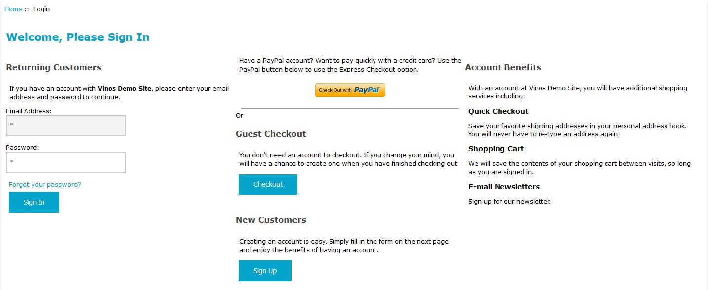

# *Login* Page Modifications #

When a store has enabled the *OPC* as well as either its *registered-account* handling (setting ***Configuration->One-Page Checkout Settings->
Enable Account Registration?*** to *true*) or *guest-checkout* (setting ***Configuration->One-Page Checkout Settings->
Enable Guest Checkout?*** to *true*) feature, the store's `login` page display is altered.

The page's layout is controlled by the setting ***Configuration->One-Page Checkout Settings->
Login Page Layout***, which maps the page's five (5) blocks into one to three columns.  That value is entered as an *encoded string*, using semi-colons (;) to separate columns and commas (,) to separate the blocks &mdash; the default value **L;P,G,C;B** was used to create the sample screenshot below.

Those page-level blocks are:

1. **L** ... (required) The email/password login block.
2. **P** ... (optional) The PayPal Express Checkout shortcut-button block.  This block is displayed only if the customer has an item in their cart.
3. **G** ... (required) The guest-checkout block.  This block is displayed only if the customer has an item in their cart and OPC's *guest-checkout* is enabled.
4. **C** ... (required) The create-account block.
5. **B** ... (optional) The "Account Benefits" block.

When you include the Account Benefits block, you have control over the "benefits" displayed, by editing PHP constant definitions in `includes/languages/english/login_guest.php`.  That file includes five (5) groups of constants, e.g.

```php
define('HEADING_BENEFIT_1', 'Quick Checkout');
define('TEXT_BENEFIT_1', 'Save your favorite shipping addresses in your personal address book.  You will never have to re-type an address again!');
```

Each benefit has a title (`HEADING_BENEFIT_x`) and a description (`TEXT_BENEFIT_x`) and is displayed if both the title and description for a specific **_x** are defined and non-blank.

----------



----------

Clicking 

- *Sign In* causes the store's `login` page to process the login attempt.
- *Check Out with PayPal* sends the not-logged-in customer to PayPal for an express-checkout.
- *Checkout* starts the OPC's guest-checkout process, taking the customer to the `checkout_one` page.
- *Sign Up* causes the store's [create_account](create_account_page.md) page to be displayed.


The language-text associated with the changes is found in `includes/languages/english/login_guest.php` and the page-template is found in `includes/templates/template_default/templates/tpl_login_guest.php`.